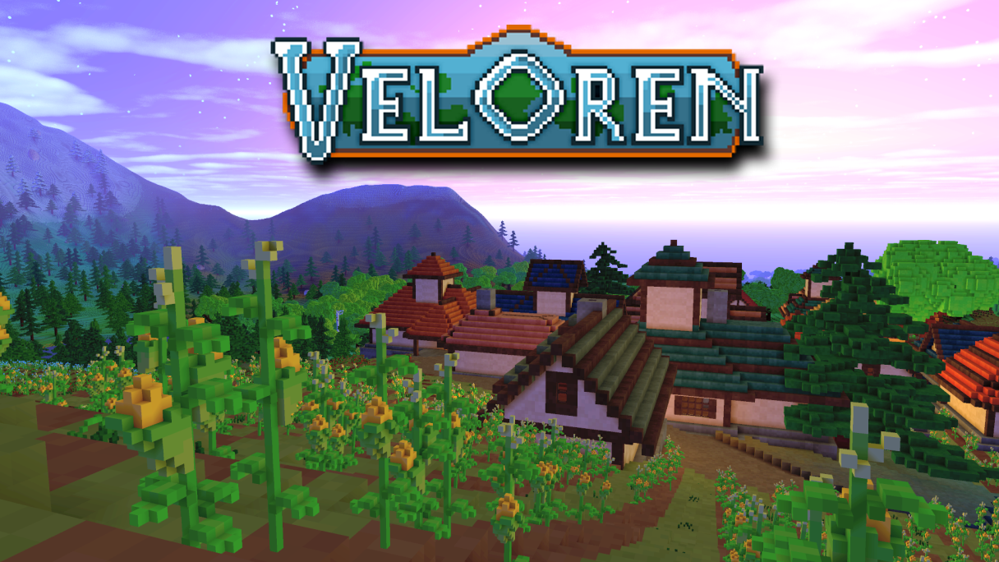

<!--
Ohart ongi: README hau automatikoki sortu da <https://github.com/YunoHost/apps/tree/master/tools/readme_generator>ri esker
EZ editatu eskuz.
-->

# Veloren server YunoHost-erako

[](https://dash.yunohost.org/appci/app/veloren)  

[](https://install-app.yunohost.org/?app=veloren)

*[Irakurri README hau beste hizkuntzatan.](./ALL_README.md)*

> *Pakete honek Veloren server YunoHost zerbitzari batean azkar eta zailtasunik gabe instalatzea ahalbidetzen dizu.*  
> *YunoHost ez baduzu, kontsultatu [gida](https://yunohost.org/install) nola instalatu ikasteko.*

## Aurreikuspena


**Paketatutako bertsioa:** 0.10.0~ynh1

**Demoa:** <server.veloren.net:14004>

## Pantaila-argazkiak



## Ezespena / informazio garrantzitsua

Veloren is in pre-alpha, il y aura des bugs.

This package provides the last "release" version of Veloren, which is older than that of the official server. You will need to download the corresponding version of the client:
 * [Windows x64](https://gitlab.com/veloren/veloren/-/jobs/artifacts/v0.10.0/download?job=windows)
 * [Linux x64](https://gitlab.com/veloren/veloren/-/jobs/artifacts/v0.10.0/download?job=linux)
 * [MacOS x64](https://gitlab.com/veloren/veloren/-/jobs/artifacts/v0.10.0/download?job=macos)

## Dokumentazioa eta baliabideak

- Aplikazioaren webgune ofiziala: <https://veloren.net/>
- Erabiltzaileen dokumentazio ofiziala: <https://book.veloren.net/players/>
- Administratzaileen dokumentazio ofiziala: <https://book.veloren.net/players/hosting-a-server.html>
- Jatorrizko aplikazioaren kode-gordailua: <https://gitlab.com/veloren/veloren>
- YunoHost Denda: <https://apps.yunohost.org/app/veloren>
- Eman errore baten berri: <https://github.com/YunoHost-Apps/veloren_ynh/issues>

## Garatzaileentzako informazioa

Bidali `pull request`a [`testing` abarrera](https://github.com/YunoHost-Apps/veloren_ynh/tree/testing).

`testing` abarra probatzeko, ondorengoa egin:

```bash
sudo yunohost app install https://github.com/YunoHost-Apps/veloren_ynh/tree/testing --debug
edo
sudo yunohost app upgrade veloren -u https://github.com/YunoHost-Apps/veloren_ynh/tree/testing --debug
```

**Informazio gehiago aplikazioaren paketatzeari buruz:** <https://yunohost.org/packaging_apps>
